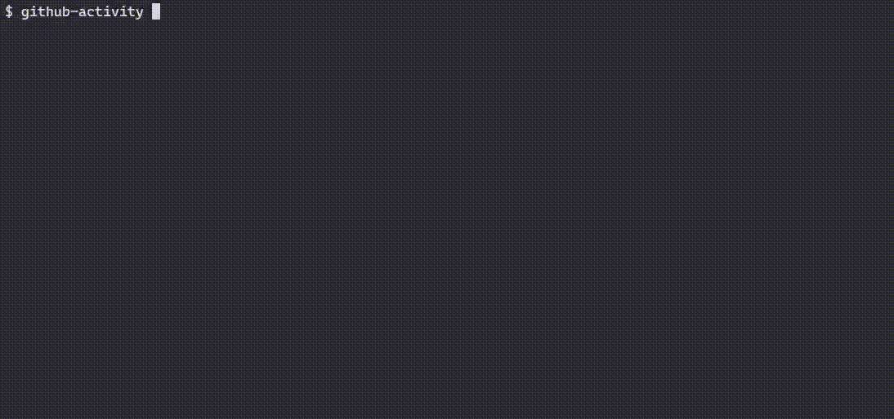

# Tasker

Task tracker CLI app to track your tasks and manage your to-do list.

## Demo



## Build

```Makefile
build:
	go build -o bin/github-activity
run: build
	./bin/github-activity
test:
	go test -v ./...
install: build
	go install -v
```

## Tech Stack

Go, Cobra CLI Framework

## Acknowledgements

- [GitHub User Activity](https://roadmap.sh/projects/github-user-activity)
- [Cobra](https://github.com/spf13/cobra)
- [Go](https://go.dev/)
